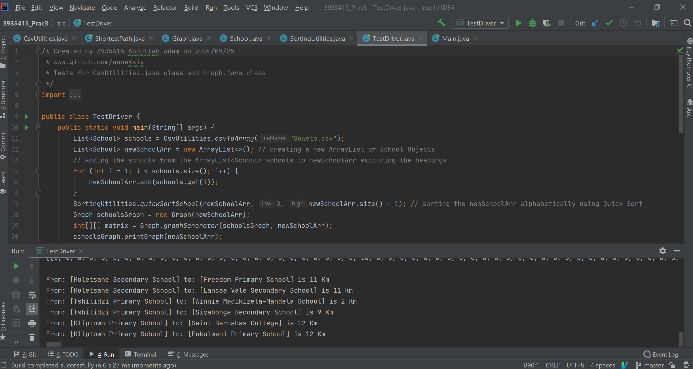
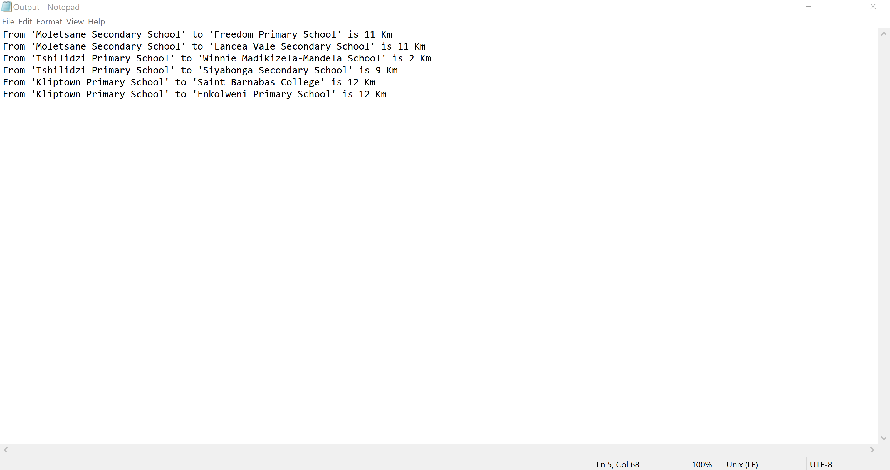

# CSC212S2T2P3
## 3935415, Abdullah Idrees Adam implementation of Practical 3 for CSC212
### My GitHub can be found at: [Github](https://www.github.com/anneKsiy/ "Github home for Abdullah 'anneKsiy' Adam ")
### **What is included?**
* TestDriver.java, the tests which were written before any of the other classes
* School.java, the School Class which is the template for creating School Objects
* SortingUtilities.java, contains the utility methods for sorting
* CSVParser.java, contains the methods to parse through the CSV file, as well as to write to a file according to the practical spec
* Graph.java, contains the Graph class and Depth First Search and Breadth First Search methods
* ShortestPath.java, contains shortest path algorithm and Dijkstra's implementation on adjacency matrices
* Main.java, completes all tasks specified by the practical spec
* Finally, there are two screenshots below!
#### All non-trivial code is commented! 

